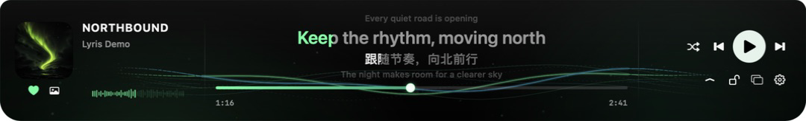
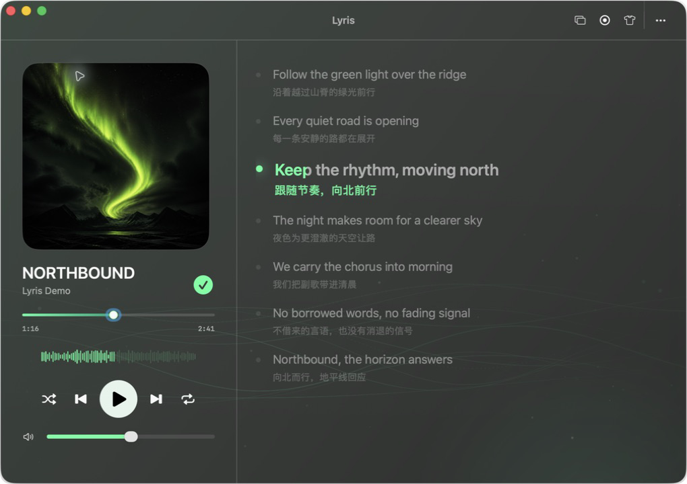
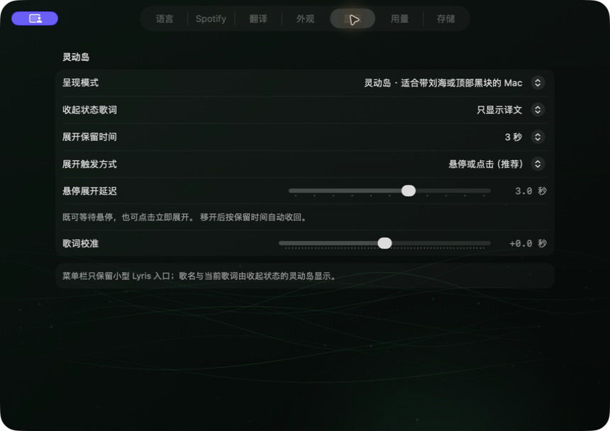

# Lyris

Lyris is a native macOS Spotify and synchronized-lyrics companion. The repository, Swift package, executable, application bundle, and project-local data directory all use the **Lyris** identity.

[Download Lyris v1.0.0](https://github.com/Yifo98/Lyris/releases/tag/v1.0.0) · Apple Silicon · macOS 13+

## Screenshots

### Mac Dynamic Island



### Desktop lyrics



### Display and interaction settings



## Preserved core

- Spotify PKCE and profile-scoped Keychain credentials
- Local, Web, and Hybrid playback coordination
- Monotonic playback clock and stale-result protection
- LRCLIB lyrics, matching, LRC import/export, retries, cancellation, and local cache
- Translation, language detection, user overrides, usage estimates, and secret redaction

The retired MeloFloat overlay and brand are no longer part of the running application. Lyris uses a clean SwiftUI/AppKit shell with a persistent top player, a full lyrics window, and a menu-bar popover.

## Current executable

`apple/Lyris` is the native Swift package and builds `Lyris.app`.

For normal local use, double-click `启动 Lyris.command` in the repository root. It rebuilds only when source or packaging files are newer than the App binary, then opens Lyris.

```bash
cd apple/Lyris
swift test
./scripts/build-qa-app.sh
open .build/qa/Lyris.app
```

## Data and privacy

Project-local non-secret data remains in `LyrisData/`. API keys and Spotify refresh tokens remain in macOS Keychain. Cleanup must not delete user-authored lyrics, configuration, or credentials.

Behavioral research remains under `docs/competitive-research/`. Reference projects are evidence, not source-code donors.
The approved design contract is in `docs/design/lyris-design-contract.md`.
